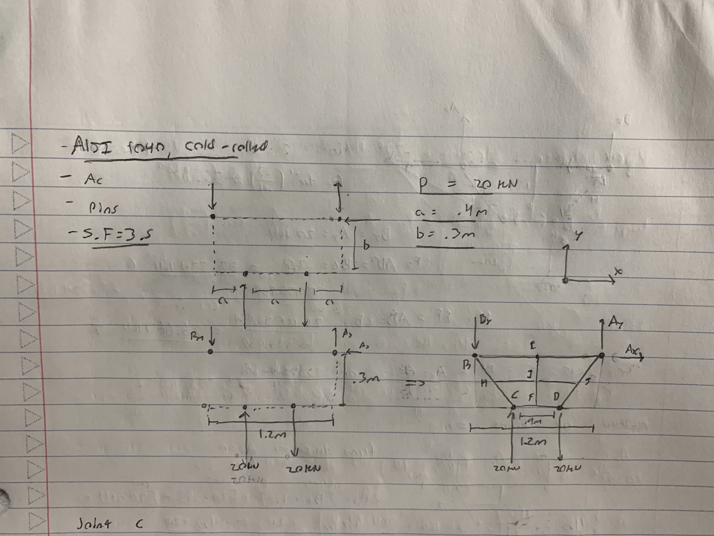
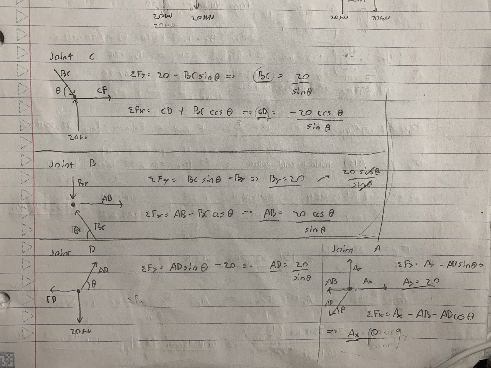
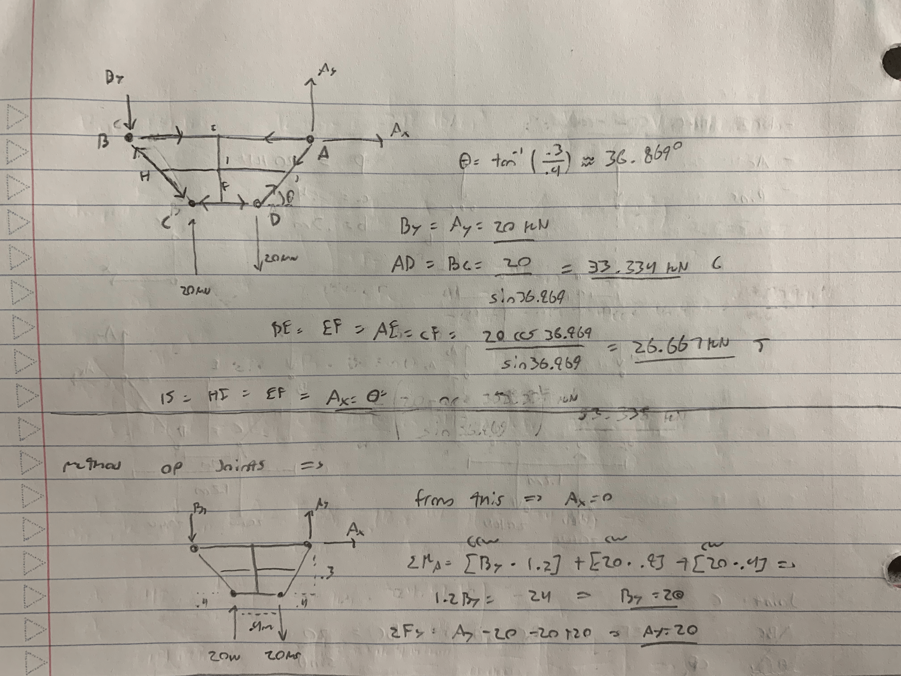
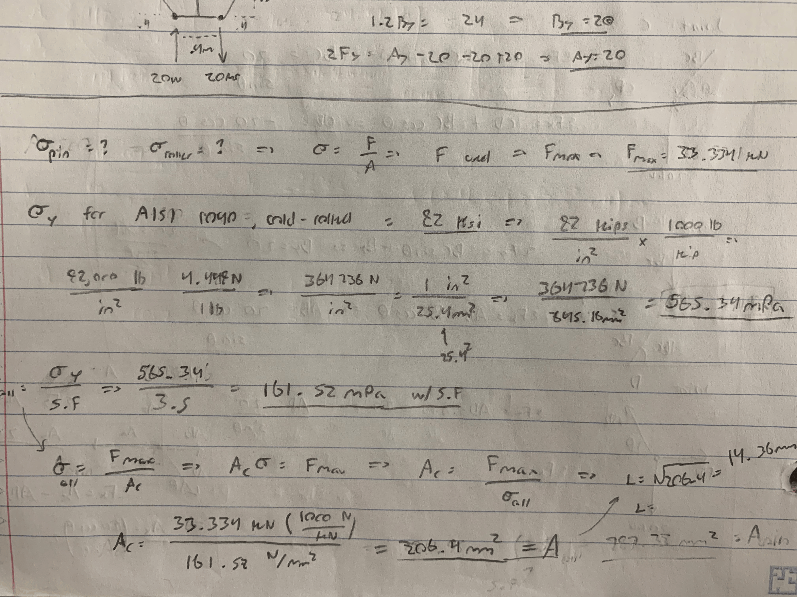
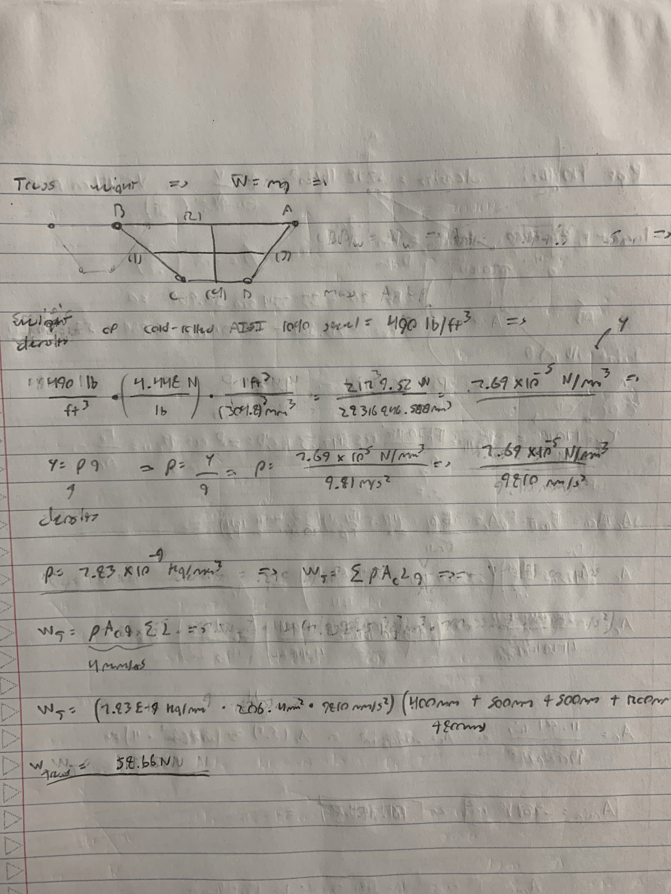
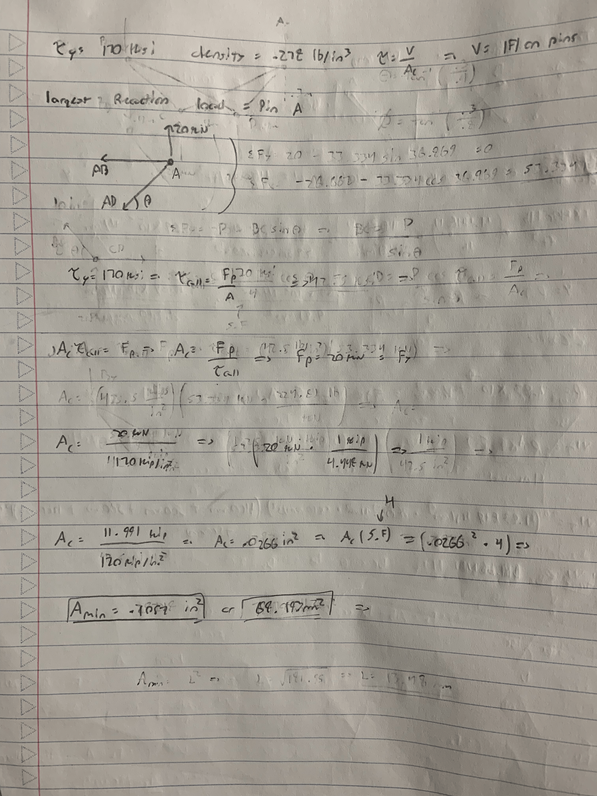

# A2 – Truss Stress Analysis

## Objective
 
 
The objective of the assignment is to design a light weight planar truss meets requirements (Safety factor, weight optimization, etc) that would be important when designing a functional truss. This would be accomplished by first creating the struss design and modeling it in CAD software to find its mass properties and run the necessary simulations.
 
 

## Analyze
The first step is to of course create a truss design. I chose this truss design so that solving the forces in each truss were kept the most simple while still accounting for the designs overall strength, where the four truss members in the middle have zero newtons acting on them, making the outside members the only members in the truss affected by the load. When it comes to failure. the truss members in the middle can resist the nature of the load, which is to rotate counter clockwise on member CD (or CF and DF).
 

### Truss

#### Member calculations
I used the method of joints and method of sections to find the force in each truss member. I first investigated joint C to start with a known force to solve for the other members acting on joint C. With the solved forces, the rest of the joints can be found. Its important to note that the four truss members in the middle will have zero newtons acting on it, so excluding them from the free body diagrams or the truss overall is acceptable. Support forces and known forces only act in the y-direction as well, therefore the support force in the x-direction at A equates to zero. The solved truss gave members AD and BC as the largest at 33.334 kN, members BA and CD 26.667 kN, and the two support forces at 20 kN.
 
 

#### Normal stress
With the solved forces, the next step was to calculate the allowable normal stress the truss must comply to. The truss is made from A151 1040 cold-rolled which has a yield strength of 82 kips per square inch. I converted the 82 Ksi to 565.34 Megapascals or .0565 Gigapascals so that the stress is in metric units- the same as the truss dimensions. Diving the yield strength by the factor of safety 3.5 gives the allowable stress on the truss. I then found the minimum cross-sectional area of the truss by diving the maximum force felt in the truss, 33,334 kN, converted to newtons, divided by the allowable stress. the result was 206.4 millimeters squared.
 
 

#### Weight of the truss
The weight density of AISI 1040 Cold-rolled steel is 490 pound per feet cubed. to find the weight, I used the formula of weight equal to density times the cross-sectional area and the truss members respective lengths. I first converted the weight density to newtons or millimeters cubed to maintain metric units. the weight density over gravity is the density used, which was 7.83 * 10^-9 kilograms over millimeters cubed. The formula for weight could be performed, and the result was the weight of the truss to be 58.66 newtons.
 
 

### Pins
#### Shear stress
The force and allowable stress in the pins must be evaulated as well. I created another free body diagram of pin A, and the only and largest force acting on it is 20 kN. The pins are made of hardened tool steel, with a yield shear strength of 170 ksi and density of 0.278 pound per square inch. I divided the maximum force by the yield strength to find the minimum cross-sectional area before applying the factor of safety. The minimum area with an applied factor of safety of 4 is .1057 square inches or 68.193 millimeters squared.
 
 

## Communicate

