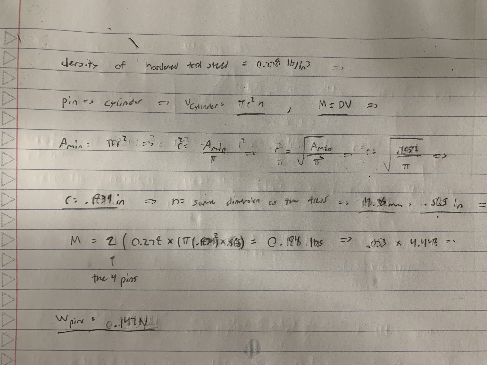
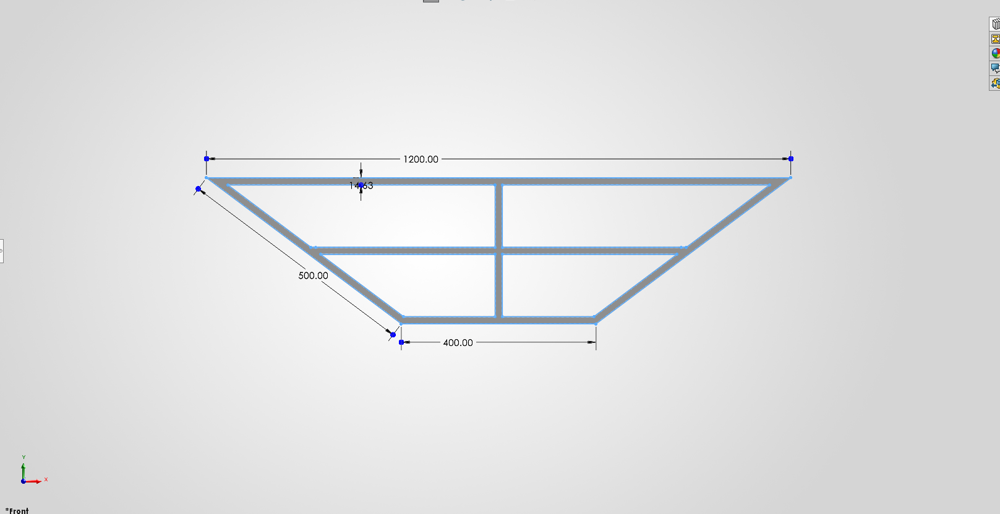
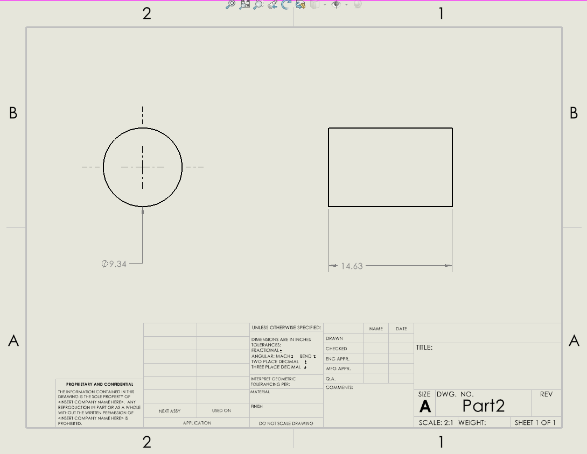

# A2 – Truss Stress Analysis

## Objective
 
 
The objective of the assignment is to design a light weight planar truss meets requirements (Safety factor, weight optimization, etc) that would be important when designing a functional truss. This would be accomplished by first creating the struss design and modeling it in CAD software to find its mass properties and run the necessary simulations.
 
 

## Analyze
### Truss
The first step is to of course create a truss design. I chose this truss design so that solving the forces in each truss were kept the most simple while still accounting for the designs overall strength, where the four truss members in the middle have zero newtons acting on them, making the outside members the only members in the truss affected by the load. When it comes to failure. the truss members in the middle can resist the nature of the load, which is to rotate counter clockwise on member CD (or CF and DF). An alternative truss design would be to create three equilateral triangles, however I chose to keep my design because I have already uploaded and embedded the PNG's, and having to change the design would mean reuploading those images and recalculating it in its entirety.
 

#### Member calculations
I used the method of joints and method of sections to find the force in each truss member. I first investigated joint C to start with a known force to solve for the other members acting on joint C. With the solved forces, the rest of the joints can be found. Its important to note that the four truss members in the middle will have zero newtons acting on it, so excluding them from the free body diagrams or the truss overall is acceptable. Support forces and known forces only act in the y-direction as well, therefore the support force in the x-direction at A equates to zero. The solved truss gave members AD and BC as the largest at 33.334 kN, members BA and CD 26.667 kN, and the two support forces at 20 kN.
 
 

#### Normal stress
With the solved forces, the next step was to calculate the allowable normal stress the truss must comply to. The truss is made from A151 1040 cold-rolled which has a yield strength of 82 kips per square inch. I converted the 82 Ksi to 565.34 Megapascals or .0565 Gigapascals so that the stress is in metric units- the same as the truss dimensions. Diving the yield strength by the factor of safety 3.5 gives the allowable stress on the truss. I then found the minimum cross-sectional area of the truss by diving the maximum force felt in the truss, 33,334 kN, converted to newtons, divided by the allowable stress. the result was 206.4 millimeters squared.
 
 

#### Weight of the truss
The weight density of AISI 1040 Cold-rolled steel is 490 pound per feet cubed. to find the weight, I used the formula of weight equal to density times the cross-sectional area and the truss members respective lengths. I first converted the weight density to newtons or millimeters cubed to maintain metric units. the weight density over gravity is the density used, which was 7.83 * 10^-9 kilograms over millimeters cubed. The formula for weight could be performed, and the result was the weight of the truss to be 58.66 newtons.
 
 

### Pins 
#### Shear stress
The force and allowable stress in the single shear pins must be evaulated as well. I created another free body diagram of pin A, and the only and largest force acting on it is 20 kN. The pins are made of hardened tool steel, with a yield shear strength of 170 ksi and density of 0.278 pound per square inch. I divided the maximum force by the yield strength to find the minimum cross-sectional area before applying the factor of safety. The minimum area with an applied factor of safety of 4 is 0.1057 square inches or 68.193 millimeters squared.
 
 

#### Weight of the pins
With a given density of the pins material, the weight of the two pins can be calculated easier. the mass of the pins is the density times the volume, and the the pins are is assumed to take the shape of a cylinder for simplicity. Setting the cross-sectional area to the area of a circle, the radius of the pin can be found. the radius of the pin is .1834 inches, and as the pins are cylindrical, the height of the pins must be the length of the truss. assuming the cross-sectional area of the truss is a square, its length is 14.36 millimeters or 0.565 inches. Multiplying the volume times the density and the amount of pins, two, gives the total mass, which came out to be .033 pounds or .147 newtons.
 
 

## Decide 
### CAD models
The mass calculated from SolidWorks for the truss and pins are 5896.43 grams and 7.88 grams. the measurements equate to 56.98 newtons and .153 netwons (combined pin mass), which are close to the estimated value from my calculations. under the given external load of two 20 kN forces going in opposite direction, the truss design will be able to withstand the load.

## Communicate
### Truss members expected failure mode
#### Yielding 
Members CF, DF, CH, CB, AJ, and DJ are the most likely to fail due to the yield strength. The fact that these members in tension makes them for susceptible for the reason that stretching steel, in this case cold rolled AISI 1040 steel, is a ductile material in this case and takes less strength than it is to compress it. limiting members in tension is not realistic, but a design modification to stop the possibility of those members failing is to add more members in tension, that way the load is distributed over more members and keeps it in the elastic range.
#### Fracture
Fracture occurs when an external load or internal stress exceeds the materials strength. Members CF, DF, BH, BE, EA, AJ, have the possibility to fail from fracture, considering external forces are concentrated at the joints and experience the most internal force. Adding more members connected to joints A, B, C, and D would reduce the likelihood of fracture faliure, for the internal forces derived from the external load would be distributed to more members, lowering the overall stress that could exceed the steel's strength.
#### Buckling
Buckling is most common in members connected to a pin and feeling a compressive force or compression in both directions. 

