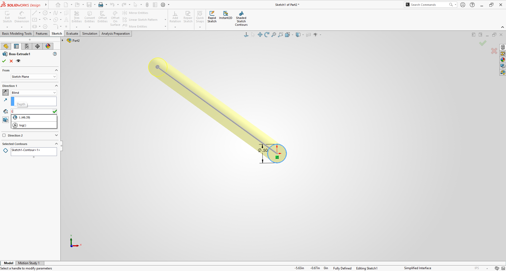
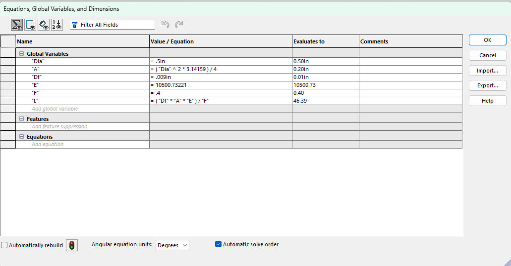
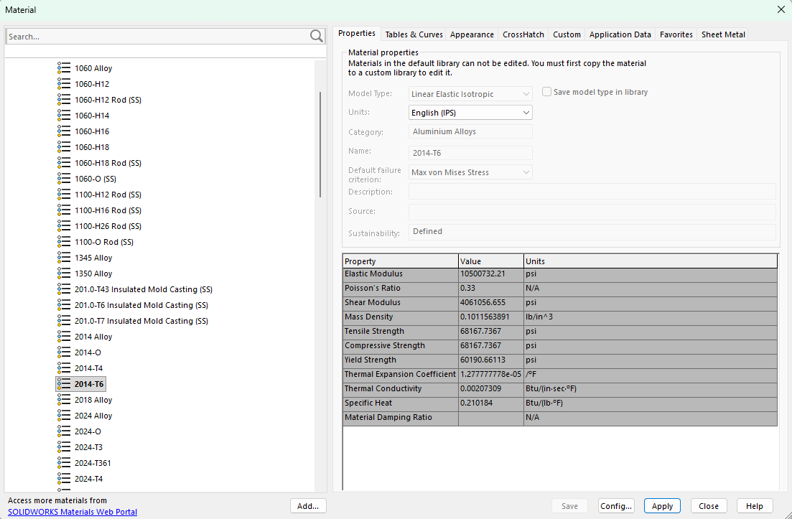
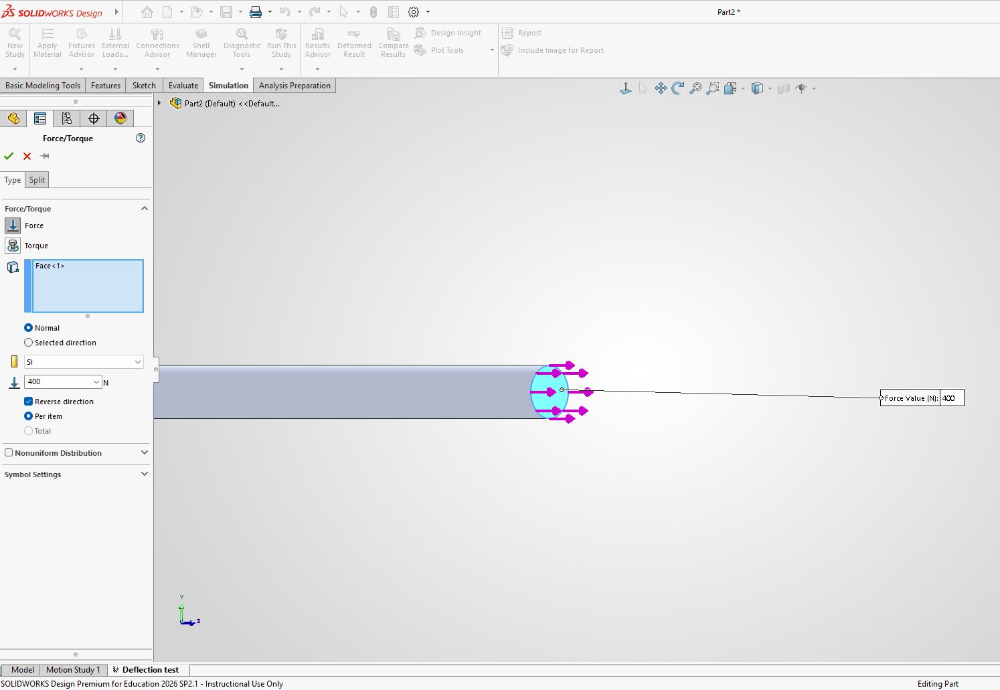
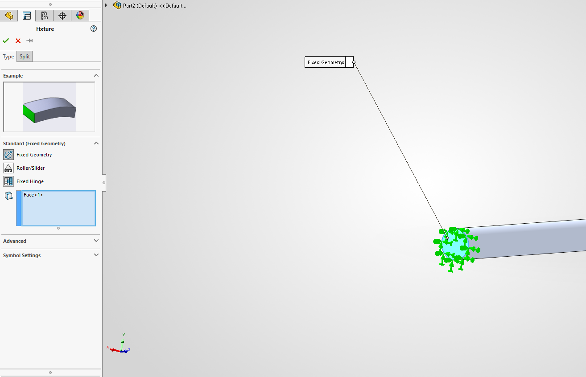
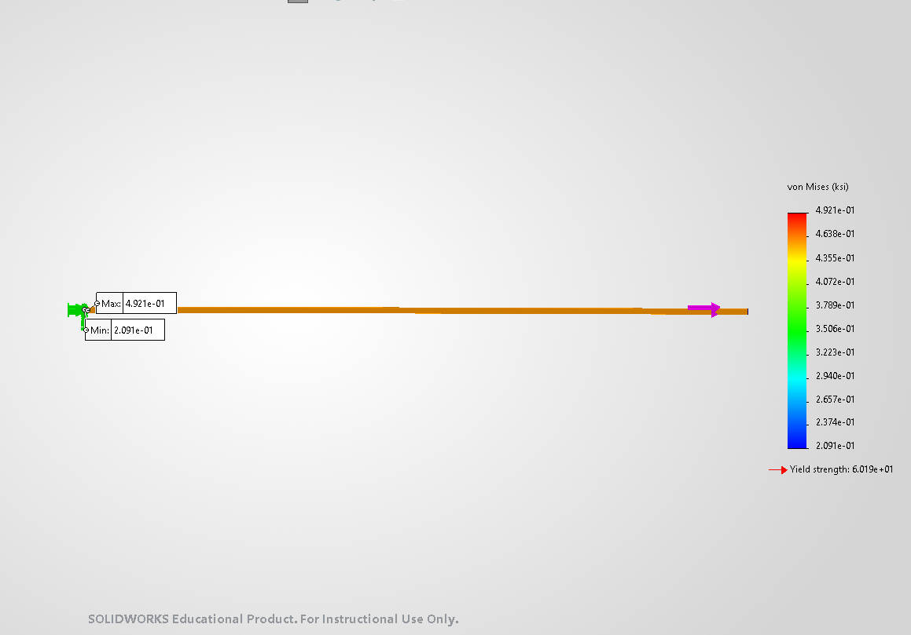
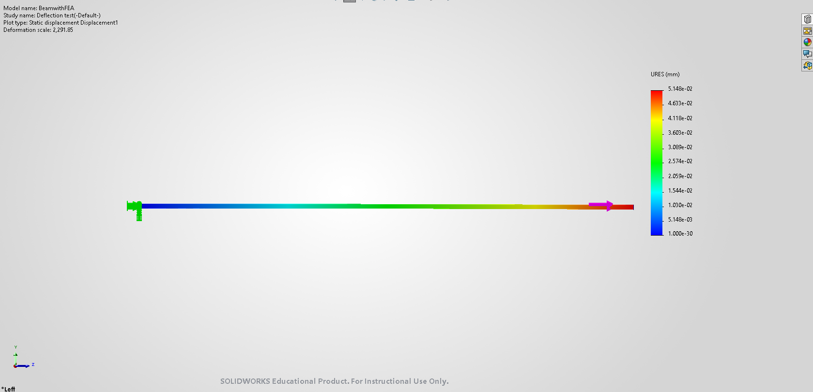

# A3 – Parametric and FEA

## Objective
The objective of this assignment was to design bar of a circular cross section in CAD software to simulate its deflection from an applied load using finite element analysis. The bars deflection, area, applied force, and modulus of elasticity were determined beforehand to estimate the length given the material and shape the bar will be in: The applied direct load must be between 300 to 500 pounds, max axial deflection must be 0.009 inches, and the modulus of elasticity must be between 8.5 E6 to 11.5 E6 KSI. All parameters must be in the form of variables in the CAD software as well to be able to compare deflection more efficiently with different numbers.
 
 

## Analyze
I've chosen the applied force to be 400 pounds, the diameter of the cross sectional area 0.5 inches, and the material as 2014-T6 aluminum alloy with a modulus of elasticity is 10600 KSI, according to 'Mechanics of Materials: An Integrated Learning System, 5th edition'. By rearranging the direct tension elongation equation. the length of the bar can be found using the known variables: the deflection, modulus of elasticity, and cross sectional area. The CAD software chosen was SolidWorks, and its important to note that SolidWorks has 2014-T6 aluminum alloy available with a slightly different modulus of elasticity from the book, so I've separated two lengths as the calculated length and SolidWorks length. The calculated length was [insert length] and the length from SolidWorks is 46.39 inches. The variable "L" in SolidWorks uses the modulus of elasticity given in SolidWorks.
 
[insert work here]
 
 
[insert def calculations here]
 
[insert work here]

### CAD
[insert cross sectional area]
 

 

 

## Decide - FEA Simulation
For the FEA simulation, I added the applied force of 400 to the right end of the bar, and the other end a fixed geometry to emulate the wall in the original figure. Both are required to run a functional simulation on the bar.

With defined force and fixture, the simulation is able to run and generate a Von Mises stress curve, The simulation produced a heat map, showing its maximum stress and deflection. The max stress on the bar is .4291 KSI, well below the yield strength, and the maximum deflection in the bar is 0.05148 millimeters or .002 inches, which is below the max deflection as well.
 

 

## Communicate

