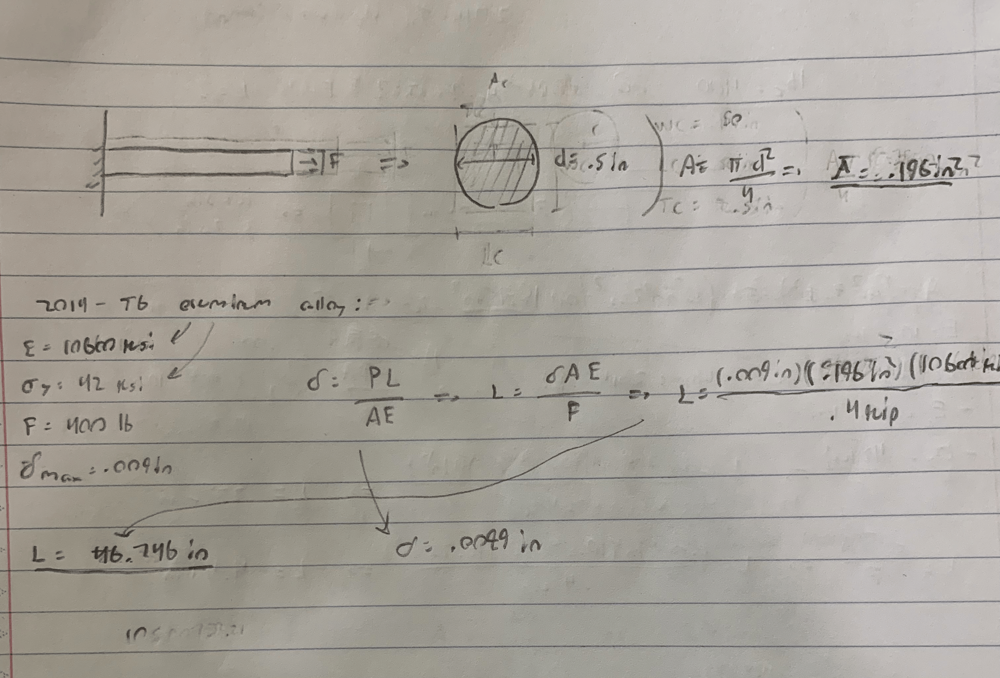
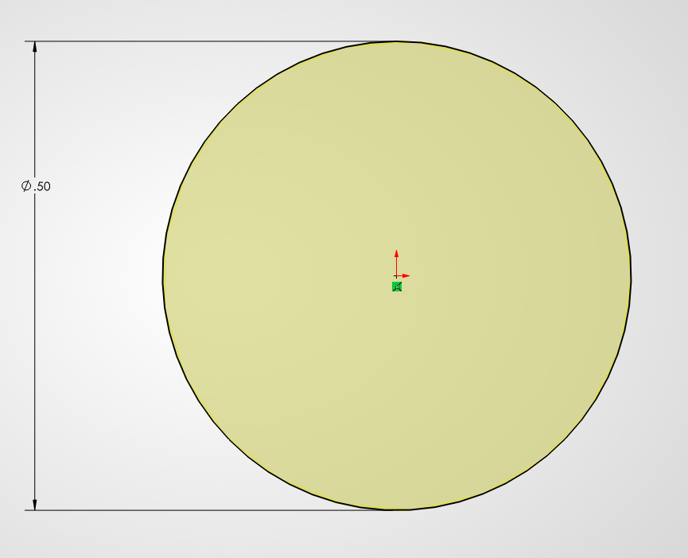
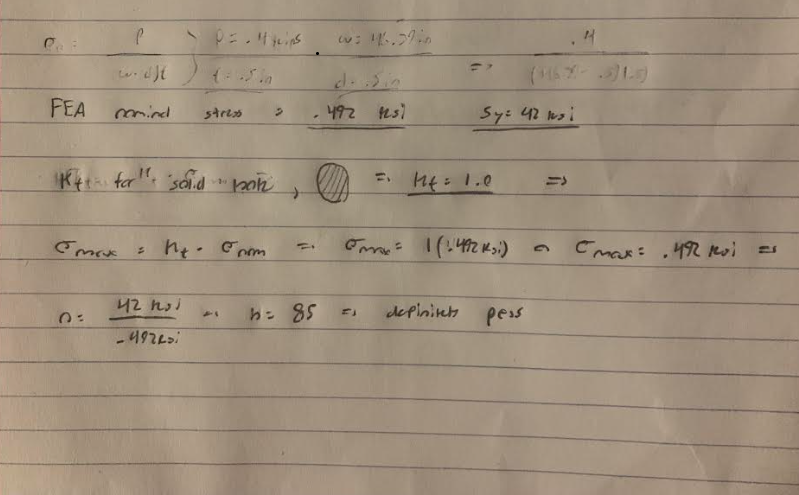
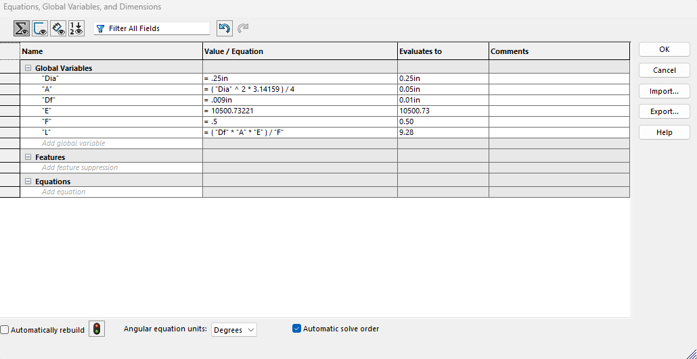

# A3 – Parametric and FEA

## Objective
The objective of this assignment was to design bar of a circular cross section in CAD software to simulate its deflection from an applied load using finite element analysis. The bars deflection, area, applied force, and modulus of elasticity were determined beforehand to estimate the length given the material and shape the bar will be in: The applied direct load must be between 300 to 500 pounds, max axial deflection must be 0.009 inches, and the modulus of elasticity must be between 8.5 E6 to 11.5 E6 KSI. All parameters must be in the form of variables in the CAD software as well to be able to compare deflection more efficiently with different numbers.
 
 

## Analyze
I've chosen the applied force to be 400 pounds, the diameter of the cross sectional area 0.5 inches, and the material as 2014-T6 aluminum alloy with a modulus of elasticity is 10600 KSI, according to 'Mechanics of Materials: An Integrated Learning System, 5th edition'. By rearranging the direct tension elongation equation. the length of the bar can be found using the known variables: the deflection, modulus of elasticity, and cross sectional area. The CAD software chosen was SolidWorks, and its important to note that SolidWorks has 2014-T6 aluminum alloy available with a slightly different modulus of elasticity from the book, so I've separated two lengths as the calculated length and SolidWorks length. The calculated length was [insert length] and the length from SolidWorks is 46.39 inches. The variable "L" in SolidWorks uses the modulus of elasticity given in SolidWorks.
 

### CAD
https://github.com/ajchiocca/megr2157-portfolio/raw/refs/heads/main/docs/assignments/A03/BeamwithFEA.SLDPRT

 

 

 

## Decide
### FEA Simulation
For the FEA simulation, I added the applied force of 400 to the right end of the bar, and the other end a fixed geometry to emulate the wall in the original figure. Both are required to run a functional simulation on the bar.

With defined force and fixture, the simulation is able to run and generate a Von Mises stress curve. The simulation produced a heat map, showing its maximum stress and deflection. The max stress on the bar is .4291 KSI, well below the yield strength, 42 KSI, the factor of safety for the material would be 68.1 KSI over 42 KSI, which equates to 1.6. The maximum deflection in the bar is 0.05148 millimeters or .002 inches, which is below the max deflection the bar should incur on itself.
 

 

The percent difference between the calculation deflection, .0089 inches and the deflection from the simulation, .002 inches is 126%. the large difference between the two may be because of the fact that calculating the length of the beam required the deflection to be .009 inches- the maximum deflection. Another reason could be that the FEA simulation doesn't include gravity, where if it did include gravity, The deflection would be much higher. And for that reason, I trust the axial deflection from why hand calculations simply for that the value would be closer to the deflection if gravity was included in the FEA.
 
 
If there were a pin hole on the left hand side, the stress near the hole must be evaluated as well. The stress concentration factor of a beam of a solid circle, no other geometry involved, would be 1.0. With the nominal stress on the beam according to the FEA being .492 KSI, the maximum stress felt on he hole can be evaluated to be 1.0 times the nominal stress, making the maximum stress also .492 KSI. The maximum stress that low passes the safety factor.
 

## Communicate
I estimate spending four to six hours on this assignment, including editing the GitHub page. At first, I had trouble finding the length of the beam for the different units involved misconstrued the length. Converting to desired units was an ordeal as well, for the values of the stress and deflection in the FEA analysis were originally in megapascals and millimeters. Generally speaking, there wasn't a true obstacle that came with the assignment, just necessary nuisances that were from my own doing.
### Modified design parameters
To compare the length calculated when changing the variables in SolidWorks. I changed the diameter of the beam to be 0.25 inches, and the applied force 500 pounds. The area of the beam will obviously be less, and with the force being marginally larger, the length should be shorter than the original length. when looking at the equation for the length, the smaller area in the numerator should produce a smaller number overall. I changed the values in the equations tab in SolidWorks, and my hypothesis was correct, for the new length of the beam was 9.28 inches.

