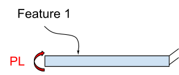
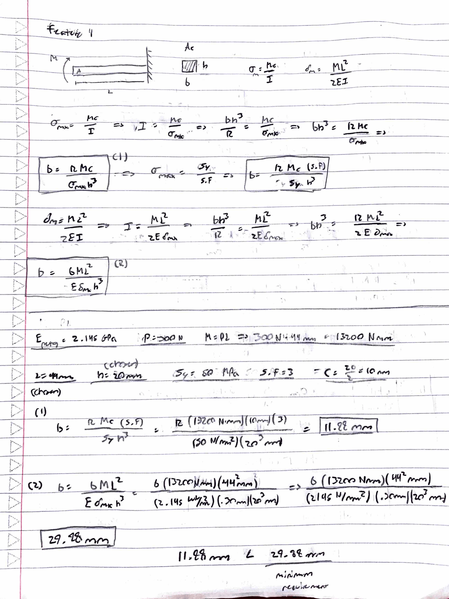

# A4 – Motor Mount

## Feature 1
The first task of the assignment was to design for feature 1, the face where the motor will connect too. For simplicity, feature 1 can be treated as a cantilever beam. the applied force of 300N on the shaft of the motor is translated to the moment on feature 1, which would be the force times the chosen length. From the cross sectional area of the beam, the base/width of the area is the dimension that will be optimized for bending and deflection to find the minimum width the mount should be to account for both. The height and length of the beam where predetermined by me.
 

 
I created the free body diagram for feature 1 as a cantilever beam and rearranged the bending moment and maximum deflection equations to solve for the base dimension, that way all known variables are on the right side of the equation. I've chosen the motor mount material to be PETG which has a modulus of elasticity of 2.145 Gigapascals, or 2145 Megapascals. The other known variables indicated as such:
 
 
Length (L) = 44 millimeters
 
Moment (M) = 300N * 44mm = 13200 Nmm
 
Height (h) = 20mm
 
distance from N.A (C) = 20/2 = 10mm
 
Safety factor (S.F) = 3
 
yield strength of PETG (Sy) = 50 MPa
 
 

## Feature 2

## Sketch

## CAD model (Parametric)

## Appendix

