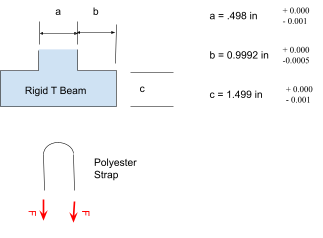
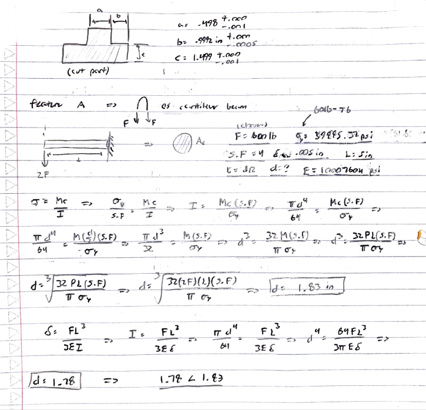
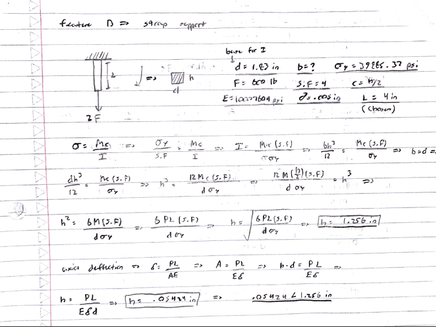

# A5 – Bracket design

## Objective
The objective of this assignment is to design a component by analyzing the normal stress, bending stress, and stiffness equations using strength of materials to determine dimensions, and the component in question is a bracket for a rigid T-beam. Additionally, a link must be designed to connect with the shaft end of the bracket end as well.
 

 

## Free body diagrams
### Feature A
The first feature I worked on the dimensions were feature A. The variable optimized for bending and deflection is the diameter of the feature. All unknown variables other than the diameter were assumed/predetermined, which was the length for feature A, and I chose the length to be 5 inches. I chose the applied force to be 600lb, and my material as 6061-T6 aluminum with a modulus of elasticity of 10007604 psi, and a yield strength of 39885.32 psi. I treated feature A as a cantilever beam and solve for the diameter from the stress bending an max deflection equations for a cantilever beam. The two diameter found were 1.78 inches and 1.83 inches- to account for both bending and deflection, the larger diameter must be chosen.
 

 
 
### Feature B
Feature B is the section that connects feature A to the rest of the part. I treated Feature B as an axially loaded beam and solved for the height/thickness of the beam.  Note that from the Free body diagram, the cross sectional area comes from rotating the part 90 degrees clockwise, which explains the FBD if there's any confusion between b and h meaning the same thing. Additionally, because the feature is treated as an axially loaded beam, the deflection equation to delta = PL/AE. I chose the length of the feature to be 4 inches long, and the calculated thickness of the part was either between 1.256 inches and .05424 inches. The most reasonable length would be 1.256 inches

## Decide

## Communicate

