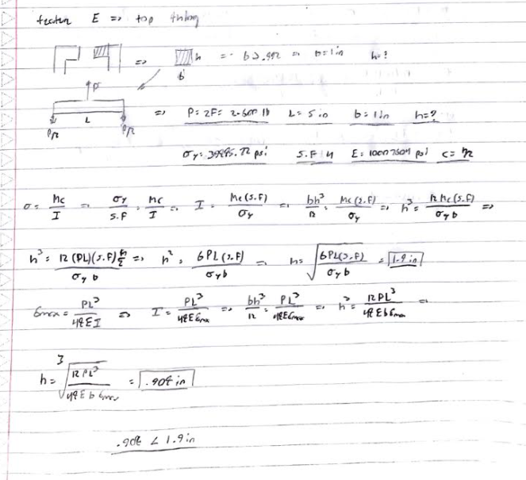
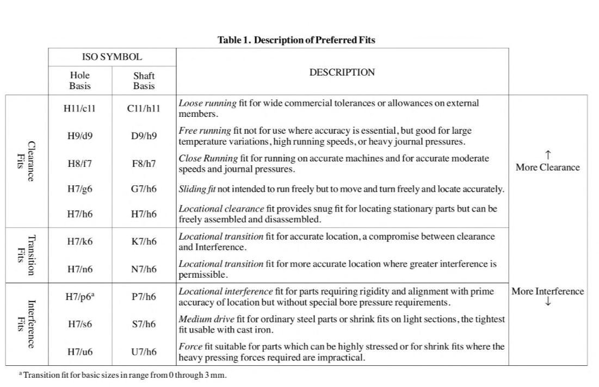
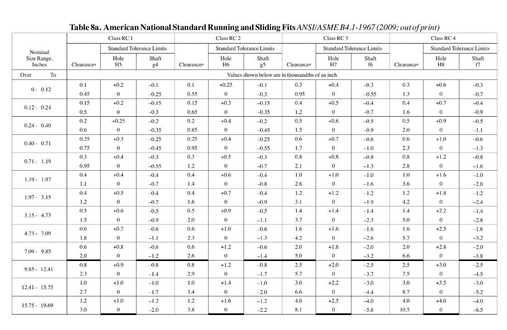
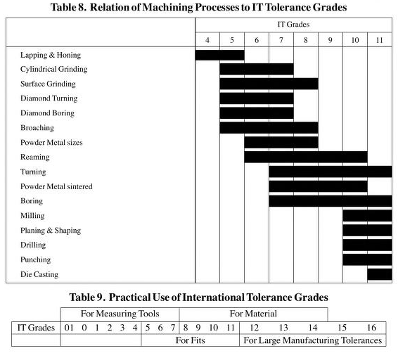

# A5 – Bracket design

## Objective
The objective of this assignment is to design a component by analyzing the normal stress, bending stress, and stiffness equations using strength of materials to determine dimensions, and the component in question is a bracket for a rigid T-beam. Additionally, a link must be designed to connect with the shaft end of the bracket end as well.
 

 

## Free body diagrams
### Feature A
The first feature I worked on the dimensions were feature A. The variable optimized for bending and deflection is the diameter of the feature. All unknown variables other than the diameter were assumed/predetermined, which was the length for feature A, and I chose the length to be 5 inches. I chose the applied force to be 600lb, and my material as 6061-T6 aluminum with a modulus of elasticity of 10007604 psi, and a yield strength of 39885.32 psi. I treated feature A as a cantilever beam and solve for the diameter from the stress bending an max deflection equations for a cantilever beam. The two diameter found were 1.78 inches and 1.83 inches- to account for both bending and deflection, the larger diameter must be chosen.
 
 

 
 
### Feature B
Feature B is the section that connects feature A to the rest of the part. I treated Feature B as an axially loaded beam and solved for the height/thickness of the beam.  Note that from the Free body diagram, the cross sectional area comes from rotating the part 90 degrees clockwise, which explains the FBD if there's any confusion between b and h meaning the same thing. Additionally, because the feature is treated as an axially loaded beam, the deflection equation to delta = PL/AE. I chose the length of the feature to be 4 inches long, and the calculated thickness of the part was either between 1.256 inches and .05424 inches. The most reasonable length would be 1.256 inches.
 
 

### Feature C
Feature C is the base support of the bracket. I treated the feature as a simply support beam with a concentrated load at the center with a length of 5 inches. The max deflection changes as well, to now deflection = PL^3/48EI. the variable to solve was the height. The base of feature C only extends to the brackets ends, so it must be .499 + .9992 + .9992 + tolerance so that it fits. I used b equal to 2.5 inches in my calculations, and the estimated height was between 1.2 inches and .669 inches. 1.2 inches was the chosen height
 
 
image

### Feature D
I treated feature D as another bar with a concentrated load in the middle, as it would make more sense if the force were concentrated in the middle rather than one point on its end or laterally. The same equations are used from feature C, only that the base dimension is to be found. The height of the feature is from the T-beams height, 1.4992, but simplified to 1.5 inches. The evaluated base for feature D were 1.604 inches and 0.222 inches-1.604 inches is obviously the correct choice.
 
 
image

### Feature E
Feature E is the final feature to be evaluated, excluding the link, although I love the idea the MEGR 2157 students have more work to do. I treated the feature as another beam with a concentrated load in the middle and evaluated the height of the part. the base length should be 1 inch according to the T-beams dimension of .992 inches. The base dimension was between 1.9 inches and .908 inches, which again, the largest dimension 1.9 inches is chosen to account for bending and deflection.
 
 

### Link

 
 
A Link must be designed that connects feature A to another cylindrical feature, such that the connection can hold using the same amount of force. From the instructions, it says the hole in the link must be 1 inch, and because my diameter must be 1.83 inches to minimize bending and deflection, I design the link to fit a 1.83 inch diameter shaft. For simplicity I assumed the shape of the link to be a rectangle a treated it as an axially loaded bar, that way I can assume a reasonable length and optimize the thickness of the link. The link i same material as the bracket, 6016-T6 aluminum alloy, and The calculated thickness of the link were between .024 inches and .12 inches- you can guess what the dimension should be used by now. For the type of fit between the link and the shaft, I assume the best type of fit to be a close running fit (RC4 clearance fit), and according to the machinery's handbook, page 653-654, for a 1.83 inch diameter shaft, in the range between over 1.19 inches to 1.97 inches, the clearance for the link diameter is -.001 or -.002, and the holes clearance should be +.0016. the proper manufacturing technique would be reaming and turning operations, for the low cost and IT grades on page 674.
 
 

## Multiview drawings

