# A6 – Bracket drawing - Part 1

## Parametric design
The objective of A5 was to created a bracket design and its dimensions. The objective for A6 builds off that bracket, with now to parametrically design the model into CAD and create and engineering drawing. Additonally, From A5, every dimensions that accounted for deflection and bending, the value bigger than the other one, was the variable from the bending equation for every driven dimension. For that matter, every driven dimension described in A6 were based on the parts strength for every "strength value" exceeded the "stiffness value", whether that's from error or it how it expected to be.
 
 
[Download Bracket here:](https://github.com/ajchiocca/megr2157-portfolio/raw/refs/heads/main/docs/assignments/A06/Bracket.SLDPRT).
 
[Download link here:](https://github.com/ajchiocca/megr2157-portfolio/raw/refs/heads/main/docs/assignments/A06/Link.SLDPRT).
 
 

 
 
All the driven dimensions from A5 were already found, and the next step is to parametrically model it on SolidWorks. I added comments to every variable to be able to differentiate the chosen and driven varibles from the calculations.
 
 
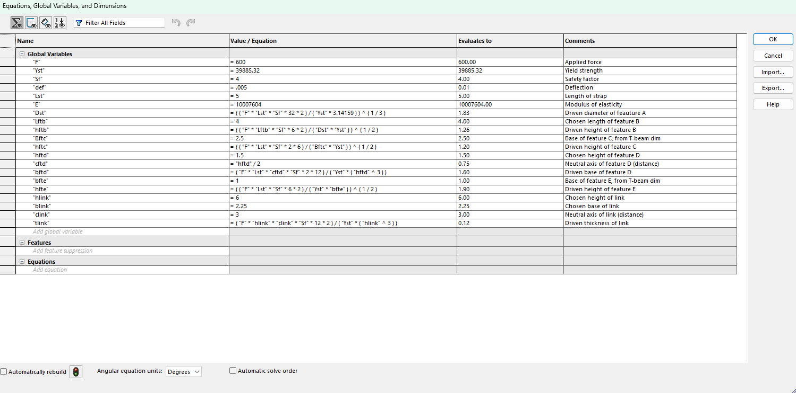
 
 
The first feature to model/start with is Feature A. Feature A is a cylinder of a driven diameter of 1.83 inches and chosen length of 4 inches.
 
 
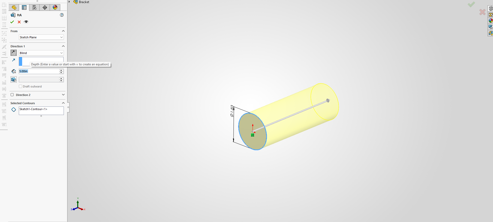
 
 
I sketched Feature B on the other side of Feature A, resembling a rectangle of width 1.83 inches, the diameter of feature A, and a chosen length of 4 inches. The driven dimensions what the features thickness, and in this case, how far the sketch is extruded is the thickness, which is 1.26 inches.
 
 
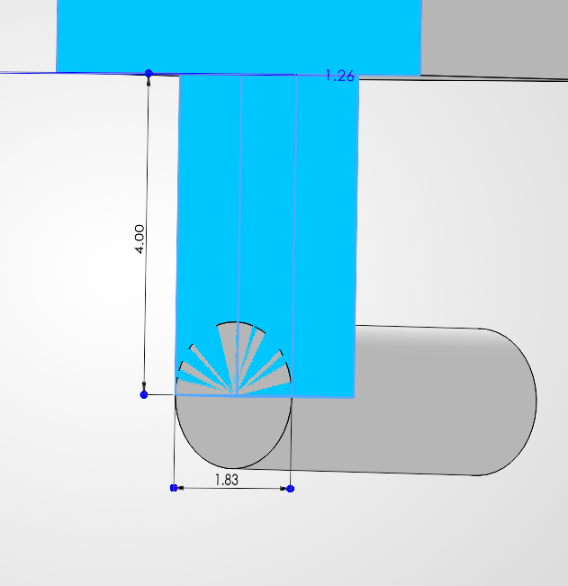
 
 
Feature C was sketched on feature B's face. Feature C isn't the whole base support, but rather the support/section under the hole where the T-beam would go. In this case, the features chosen width and length are 2.5 inches and 5 inches. The driven dimension is the height, 1.2 inches that was part of the original sketch. I am aware that between each features, base, length, and height are in different orientations. If there is any confusion about what dimensions are which, the calculations done in A5 help determine the dimensions I'm describing. 
 
 
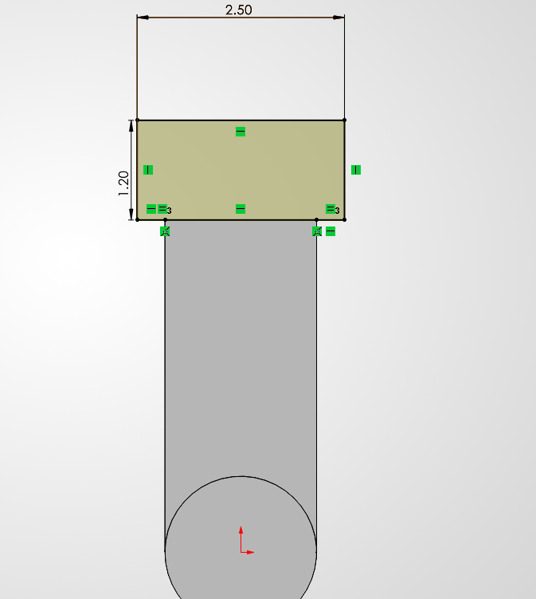
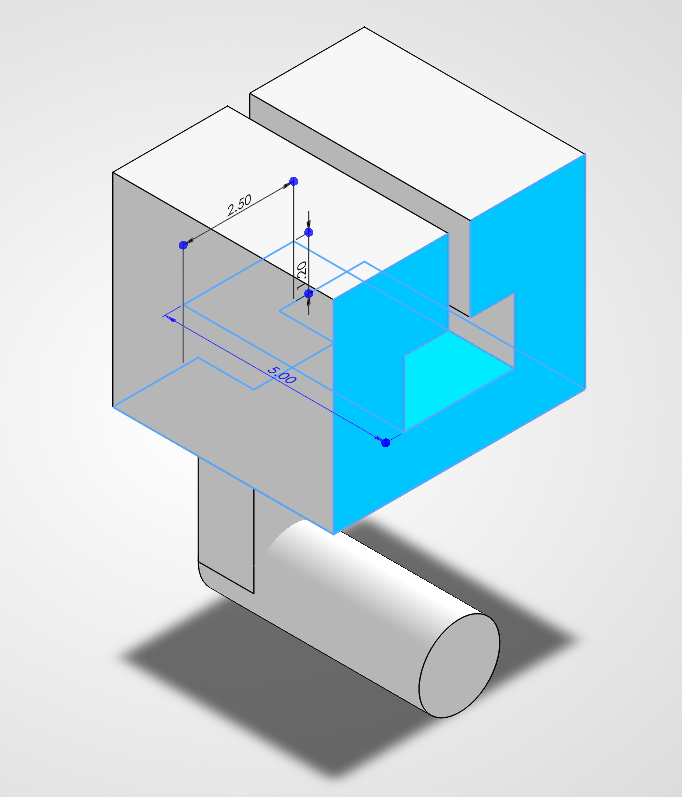
 
 
Feature D was sketched on the two corners of feature C, and like feature C, on of its dimensions are based on the hole for the T-beam. the chosen dimensions were its length of 5 inches and a height of 1.5 inches. The driven dimension was the base/width, which was evaluated a 1.6 inches. The page showcasing the extrusion on feature D isnt the clearest, but its the best perspective to showcase the depth while showing the other dimensions.
 
 
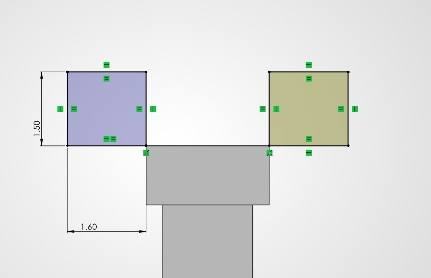
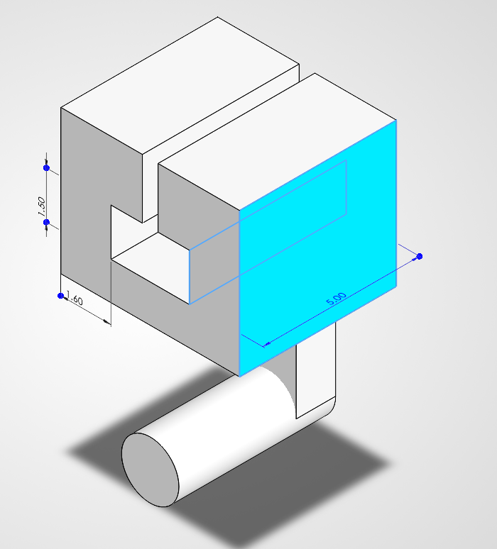
 
 
Feature E is the last parametrically driven feature for the bracket. The chosen dimensions were its length of 5 inches and base of 1 inch. The driven dimension was the feature height that calculated as 1.9 inches.
 
 
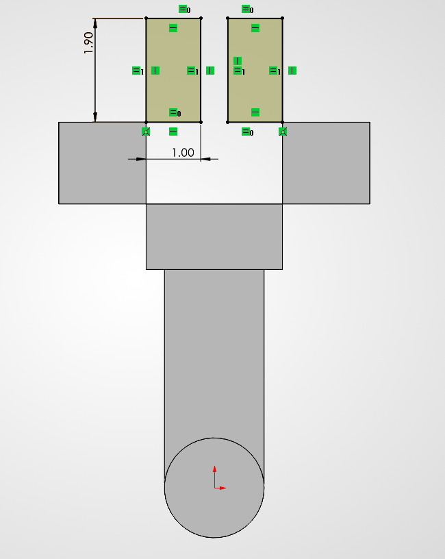
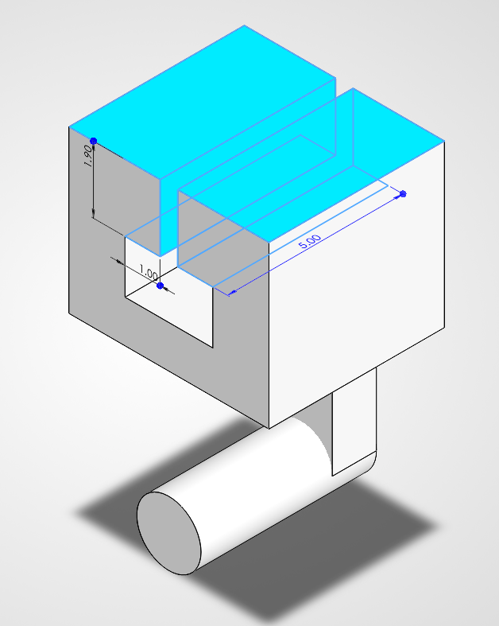
 
 
The "filler" for the bracket is the feature that connects the bracket as one whole part. I sketched four rectangles that connected Features C, D, and E's corners to finalize the design. The filler is extruded to 5 inches as well for consistency for the whole part.
 
 
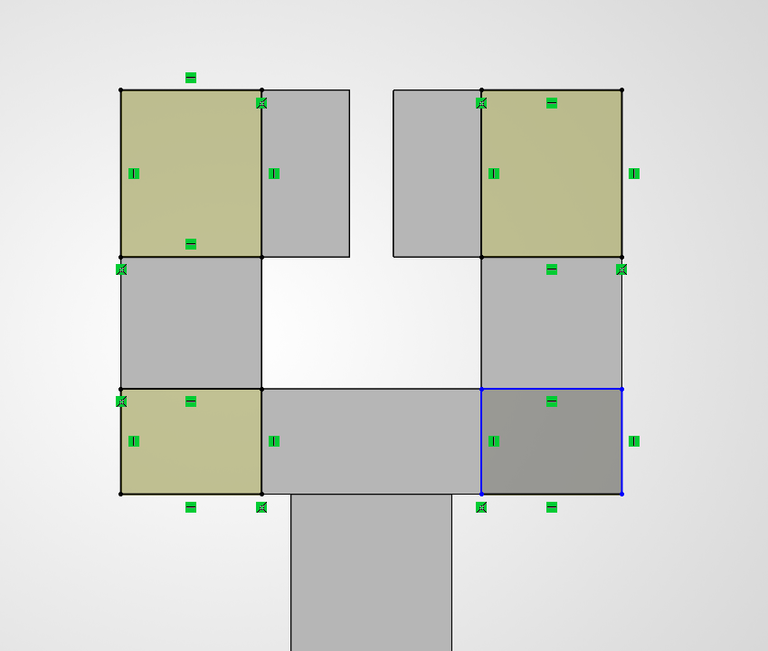
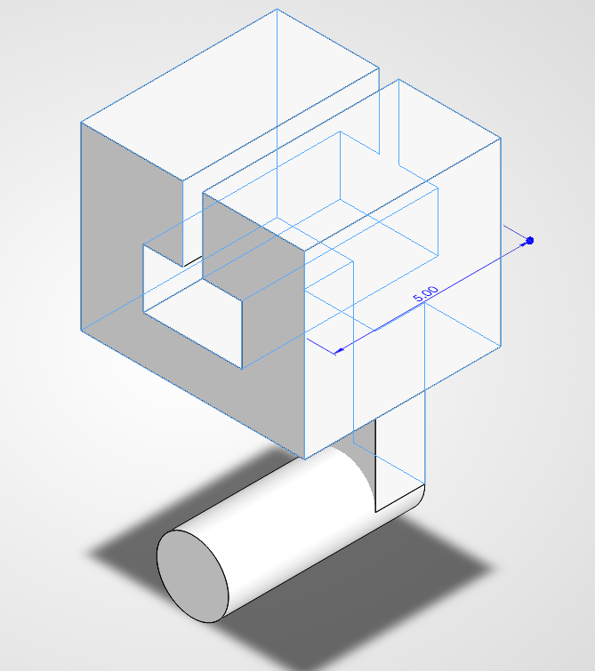
 
 
A link to connect feature A to other parts had to be parametrically modeled as well. The chosen dimensions for the link could have been almost just anything, just as long as it didn't collide with the bracket above. I chose the height of the link to be 6 inches for that matter and the distance between the end of the part and the holes to be 1.83 inches. the base of the link was chosen as 2.25 inches, and the Ddriven dimension was the parts thickness, which was driven as 0.12 inches.The chamfers on the corners of the sketch were purely for aesthetic and consideration for if the corners of the link would collide with whatever it would attach to in addition to the bracket.
 
 
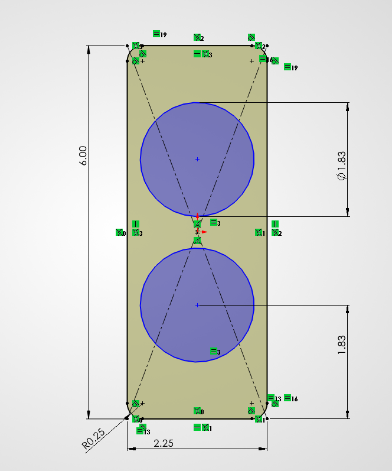
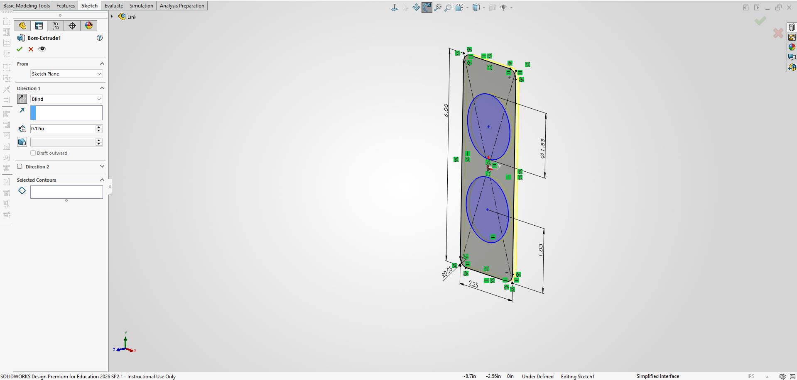

## Drawing
[Download Bracket drawing here:](https://github.com/ajchiocca/megr2157-portfolio/raw/refs/heads/main/docs/assignments/A06/brck2.SLDDRW).
 
[Download link drawing here:](https://github.com/ajchiocca/megr2157-portfolio/raw/refs/heads/main/docs/assignments/A06/linkyes.SLDDRW).
 
 
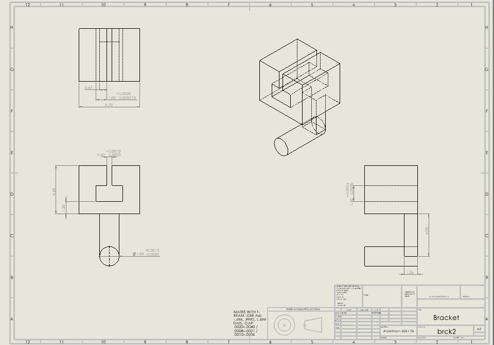
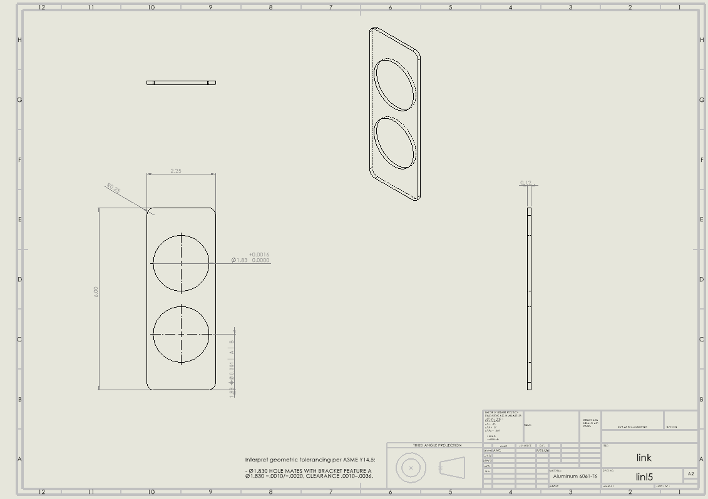

## Reflections

Compatibility came from the limits of both parts, not from a shared nominal. The bracket shaft, diameter of 1.8310–1.8280, and the link bore, a diameter of 1.8300–1.8316, both read 1.83 at nominal, but the .0010–.0036 clearance exists only because each part carries explicit limits checked against the other. At the title block's plus or minus .005, a bore could have measured 1.825, smaller than the shaft. The press-fit hole cannot absorb positional error, so the minimum clearance at the running-fit hole set the position tolerance at a diameter of 0.001. Datum A and B, the basic center distance, and the interface note tell a machinist which features mate and which are only blank.
 
 
The pocket height 1.50 +.0016/−.0000 is supposed to be a mating surface. The T-beam flange slides in it, and the .0010–.0036 gap limits play. IT8 at this size is .0016 in, so it overrides the block. The length of feature B, 4.0 plus or minus .02, mates with nothing. I sized it with axial deflection with a safety, and ±.02 shifts that deflection by 0.5%. from Table 8, milling reaches IT10–11 (about .003 to .004 in), while IT7–8 on a through slot needs broaching, grinding, or wire EDM.
 
 
Overall I may have spent at most 2 hours modeling on SolidWorks and their respective drawings. The most difficult part of this assignment was the drawings for the parts, where having to find the right fits and callouts took time to find an understand. I created the GitHub while working on the drawings, so whatever was wrong, the tolerances for the shaft diameter, I had to reupload the correct drawing PNG and SolidWorks drawing. Dimension and tolerancing communicates design intent in the way of how its supposed to be machined and how the part is going to function with other parts. Including the GitHub setup and the mistakes along the way, I estimate the total time I spent on this four hours. Out of all the assignments I've done so far, this was the most annoying.

